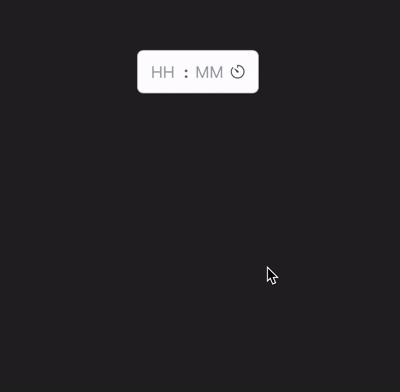

# React Time Picker

A simple, accessible, and customizable time picker component for React applications.


<!-- Replace with an actual screenshot -->

## Features

- 12-hour and 24-hour format support
- Keyboard navigation
- Accessible design with ARIA attributes
- Customizable styling with CSS variables
- Light and dark theme support
- Controlled and uncontrolled component modes

## Installation

```bash
npm install react-accessible-time-picker
# or
yarn add react-accessible-time-picker
# or
pnpm add react-accessible-time-picker
```

## Usage

### Basic Usage

```jsx
import { TimePicker } from 'react-accessible-time-picker';
import 'react-accessible-time-picker/dist/style.css'; // Import default styles

function App() {
  return <TimePicker label="Select Time" />;
}
```

### With 12-hour Format (AM/PM)

```jsx
import { TimePicker } from 'react-accessible-time-picker';

function App() {
  return <TimePicker label="Select Time" is24Hour={false} />;
}
```

### Controlled Component

```jsx
import { useState } from 'react';
import { TimePicker } from 'react-accessible-time-picker';

function App() {
  const [time, setTime] = useState({ hour: '09', minute: '30', period: 'AM' });

  return (
    <TimePicker 
      label="Meeting Time" 
      value={time} 
      onChange={setTime} 
      is24Hour={false} 
    />
  );
}
```

## Props

| Name | Type | Default | Description |
|------|------|---------|-------------|
| is24Hour | boolean | true | When true, uses 24-hour format; when false, uses 12-hour format with AM/PM selector. |
| minuteStep | number | 5 | Controls the increment/decrement step size for minutes. Also determines the minute options shown in the dropdown (e.g., 0, 5, 10, ..., 55 for step of 5). |
| hourStep | number | 1 | Controls the increment/decrement step size for hours. Also determines which hour options are shown in the dropdown. |
| value | TimePickerValue | undefined | The controlled value for the time picker. |
| onChange | (value: TimePickerValue) => void | undefined | Called when the time changes. |
| label | string | undefined | Label for the time picker. |
| id | string | undefined | ID for the time picker component. |
| disabled | boolean | false | When true, the time picker is disabled. |
| required | boolean | false | When true, the time picker is marked as required. |
| classes | TimePickerClasses | {} | Custom class names for styling individual parts. |

## Types

```typescript
type TimePickerValue = {
  hour: string;
  minute: string;
  period?: "AM" | "PM";
};

type TimePickerClasses = Partial<{
  container: string;
  label: string;
  timePicker: string;
  timeInputs: string;
  timeInput: string;
  separator: string;
  pipe: string;
  periodSelect: string;
  selectContent: string;
  selectItem: string;
  selectIndicator: string;
  selectScrollButton: string;
  popoverContent: string;
  popoverColumns: string;
  popoverColumn: string;
  popoverColumnTitle: string;
  popoverItem: string;
  popoverActiveItem: string;
  timeTrigger: string;
}>;
```

## Styling

### Using CSS Variables

The component uses CSS variables for styling. You can override these variables in your CSS:

```css
:root {
  /* Light theme variables */
  --time-text
  --time-bg
  --time-border
  --time-focus-border
  --time-separator
  --time-disabled-text
  --time-hover
  --time-focus
  --time-icon
  --time-popover-bg
  --time-popover-shadow
  --time-active
  --time-disabled-bg
  --time-scrollbar-hover-bg
  --time-scrollbar-thumb
  --time-scrollbar-thumb-hover
  --time-scrollbar-bg
  --scrollbar-size
}

/* Dark theme */
[data-theme="dark"] {
  --time-text
  --time-bg
  --time-border
  --time-focus-border
  --time-separator
  --time-disabled-text
  --time-hover
  --time-focus
  --time-icon
  --time-popover-bg
  --time-popover-shadow
  --time-active
  --time-disabled-bg
  --time-scrollbar-hover-bg
  --time-scrollbar-thumb
  --time-scrollbar-thumb-hover
  --time-scrollbar-bg
}
```

See the style.css file for default values of these variables.

### Using the classes prop

For more specific styling, use the classes prop to target individual elements:

```jsx
import styles from './custom-styles.module.css';

<TimePicker 
  classes={{
    container: styles.myContainer,
    timePicker: styles.myTimePicker,
    timeInput: styles.myInput,
    // ...other elements
  }}
/>
```

## Keyboard Navigation

- Tab: Navigate between inputs and buttons
- ArrowUp/ArrowDown: Increment/decrement hours or minutes
- ArrowUp/ArrowDown in popover: Navigate through hour or minute options

## Browser Support

This component works in all modern browsers (Chrome, Firefox, Safari, Edge).

## Accessibility

The time picker is designed with accessibility in mind, including:

- ARIA attributes for screen readers
- Keyboard navigation
- Focus management
- High contrast support

## License

MIT

## Contributing

Contributions are welcome! Please feel free to submit a Pull Request.